영상은 언리얼 엔진 4이나 언리얼 엔진 5로 따라했습니다.

## Turning on a Light via the Level BP

레벨 블루프린트를 통해 라이트 켜기

https://www.youtube.com/watch?v=_zoyaVdqHQ8&list=PLjP7GdaJBM7GIJSjelGybVbm-S1VErg5y&index=2.



### 프로젝트 생성

게임 탭 선택->삼인칭 탬플릿 선택

블루프린트 선택->시작용 콘텐츠 체크 

프로젝트 이름: ProjectBlueprint로 생성

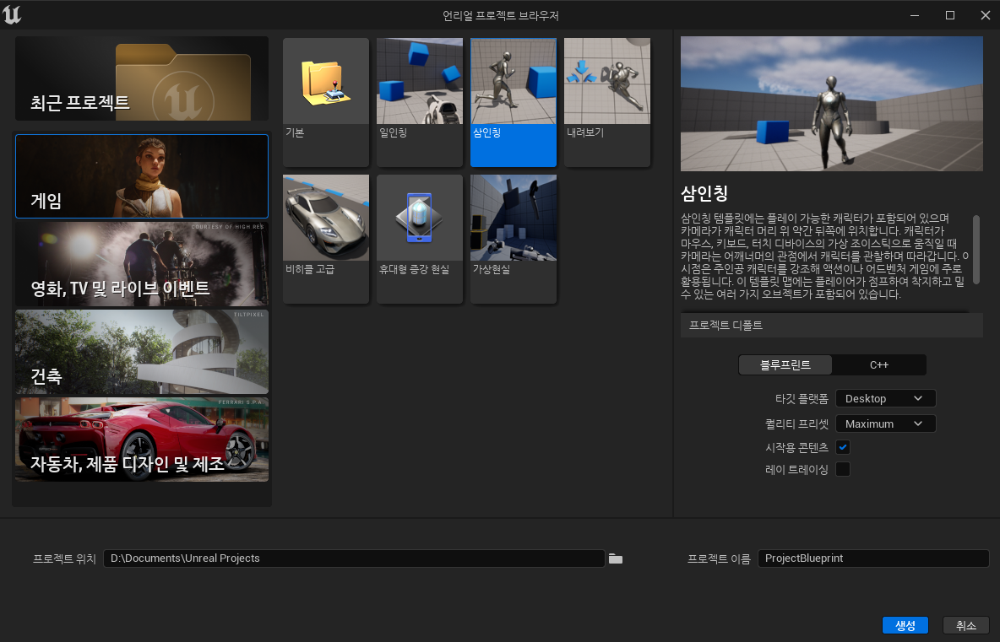

기본 맵 로딩되고 새로운 맵 작업할 것이다.

### 레벨 생성

좌상단 파일 메뉴 열고->새 레벨 선택

단축키 `Ctrl+n`

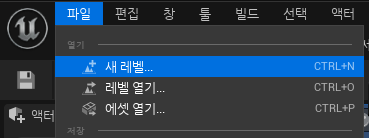

Basic 선택 후 생성

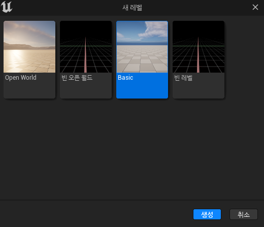

상단의 플레이 버튼 누르면 캐릭터나 카메라의 실제 조작이 가능함.

WASD로 캐릭터 조작하고 마우스로 시점 조작 가능.

`ESC`로 종료가능

단, 우리가 보는 시점이 바닥 안에 들어와야지 안떨어지고 돌아다닐 수 있다.

#### Floor 스케일 조절

!여기서 영상처럼 바닥을 작게하고 싶다면 아웃라이너 혹은 뷰포트에서 Floor 선택 후 -> 디테일 탭으로 가->스케일 8인 x, y, z 값들을 전부 1로 수정하면 바닥이 작아진다. 필자는 그대로 8인 값으로 하였다.

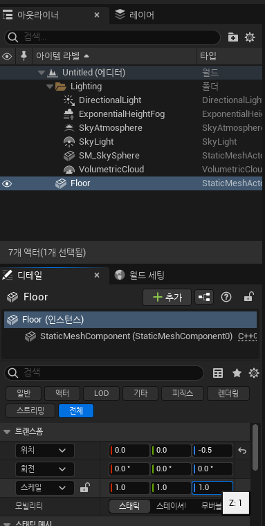

#### 플레이어 스타트 배치

그리고 또 나는 카메라를 일일히 이동하기 싫고 영상처럼 시작하고 싶다면

좌상단 창->액터 배치를 눌러 액터 배치 탭을 생성 후

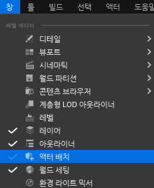

기본을 고른 후->원하는 위치에 플레이어 스타트에 좌클릭을 누르면서 뷰포트로 드래그 앤 드롭을 해준다.

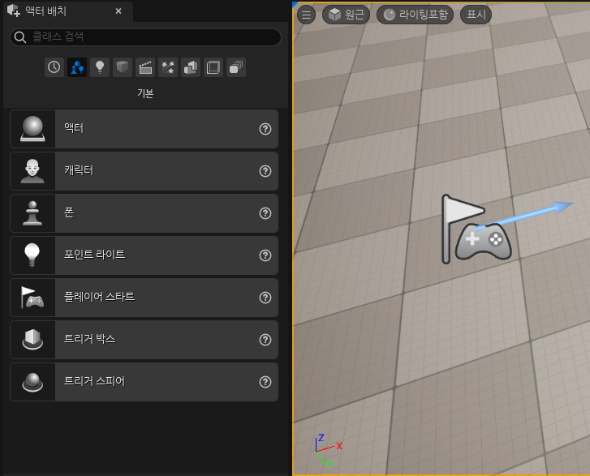 

그러고 다시 스타트를 해주면 그 위치에 캐릭터가 생성된다.

필자는 그냥 넣지 않았다.

### 콘텐츠 브라우저

좌하단에 콘텐츠 드로어를 클릭하면 콘텐츠 브라우저가 올라온다.

단축키 `Ctrl+Space bar` 

띄운 상태에서 레이아웃에 고정을 누르면 고정이 되면서

하단에 콘텐츠 브라우저 탭이 생긴다.

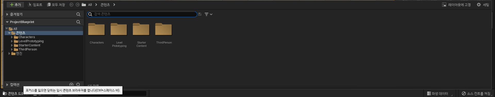

#### 문 배치

이제 All->콘텐츠->StarterContent->Architecture->Wall_Door_400x300을 좌클릭 누르면서 드래그 앤 드롭으로 뷰포트 안에 배치하자.

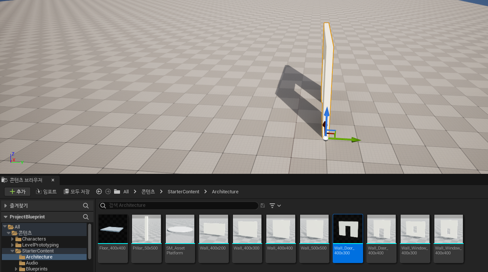 

설치한 뷰포트가 보기 불편하다 그러면 조작법을 알자.

#### 간단한 뷰포트 조작법

뷰포트 카메라 조작

| 단축키                              | 기능                                 |
| ----------------------------------- | ------------------------------------ |
| `우클릭+W/S`                        | 카메라 전/후방 이동                  |
| `우클릭+A/D`                        | 카메라 좌/우 이동                    |
| `우클릭+Q/E`                        | 카메라 아래/위 이동                  |
| `우클릭+Z/C`                        | 카메라 줌 아웃/인 (우클릭 떼면 풀림) |
| 위 키를 누르면서 마우스 휠 `스크롤` | 카메라 속도 조절 가능함              |

마우스만 사용하는 조작

| 단축키                                    | 기능                                    |
| ----------------------------------------- | --------------------------------------- |
| `좌클릭+드래그`                           | 카메라 좌/우 회전, 전/후방 수평이동     |
| `우클릭+드래그`                           | 카메라 좌/우 회전, 위/아래 회전         |
| `좌클릭+우클릭+드래그` or `휠클릭+드래그` | 카메라 좌/우 수평이동, 위/아래 수직이동 |

방금 추가한 문을 이동하고 싶다면 화살표 `좌클릭 드래그` 해주면 된다.

하늘에 떠 있다면 `End`키 한번으로 바닥에 밀착 가능하다.

`E`키로 회전 모드로 바꿀 수 있다. 이렇게 회전 이동 스케일을 조작해주는 모양을 기즈모라 한다. 다음은 기즈모에 대한 간단한 단축키이다.

기즈모는 우 상단에 이 아이콘 클릭으로도 변경 가능하다. 

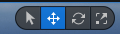

#### 기즈모 모드

| 단축키 | 기능              |
| ------ | ----------------- |
| `q`    | 선택 모드         |
| `w`    | 기즈모 이동모드   |
| `e`    | 기즈모 회전모드   |
| `r`    | 기즈모 스케일모드 |

#### 벽 복사

콘텐츠 브라우저에서 Wall_400x300을 추가하자 벽에 방향이 똑같다.

영상에서는 설치한 벽을 회전 모드에서 90도 돌리라고 한다.

회전모드로 바꾼 후 좌클릭 드래그로 돌리자.

그 후 두 벽의 모서리가 잘맞게 이동시키고

`Alt` 키를 누른 채 벽에 반대쪽 방향을 가르키는 화살표를 `좌클릭 드래그` 해서 똑같은 벽을 복사하여 반대쪽도 모서리가 잘맞게 만들어준다.

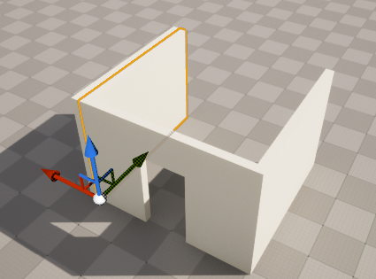

#### 콘텐츠 브라우저에서 선택된 에셋 사용

문도 이 방법으로 뒤쪽으로 복사 후

콘텐츠 브라우저에서 Wall_400x300 클릭 후 

뷰포트 혹은 아웃라이너에서 복사된 문만 선택된 상태에서

디테일 탭->스태틱 메시->콘텐츠 브라우저에서 선택된 에셋 사용을 클릭하면 벽으로 바뀐다.

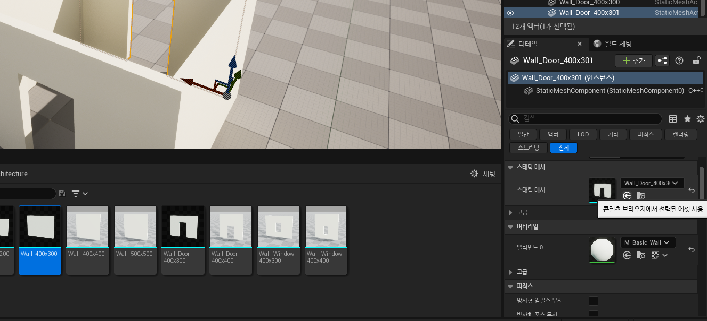

#### 지붕 만들기

이제 지붕을 만들어 주자. 뒷 벽에서 `Alt` 윗 화살표 방향 `좌클릭 드래그` 후 좀 띄우고 `End`키로 벽에 붙인 후 회전 기즈모 지붕이 되도록 눞힌 다음에

모자란 부분을 스케일 기즈모로 변경 후 원하는 방향 좌클릭 드래그로 지붕을 덮어버리자.

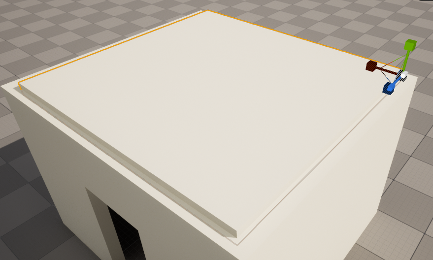

### 조명 배치

위에 플레이어 스타트를 설치했다면 액터 배치 냅두고

액터 배치 창이 없다면 창->액터 배치를 클릭하여 액터 배치 탭을 띄우자.

기본 아이콘을 클릭하자

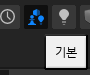

포인트 라이트를 방안으로 드래그 앤 드롭으로 배치 후

이동 모드로 변경 후 적절한 위치에 배치하자

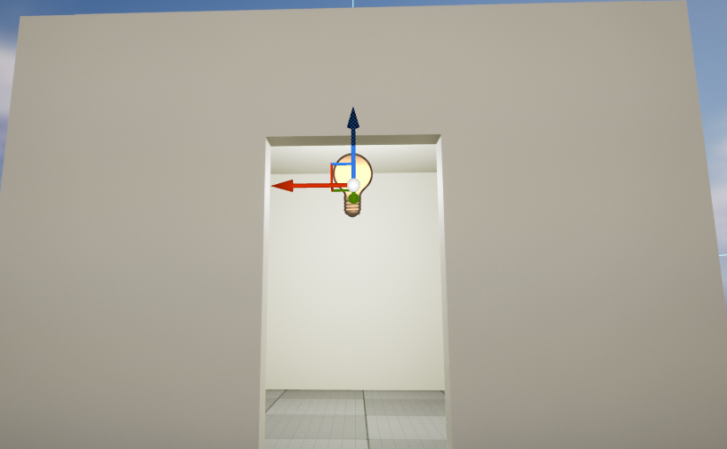

#### 포인트 라이트 디테일

디테일 탭에서 색, 강도, 반경 등 다양한 요소 조정가능

전체->렌더링->표시를 체크 해제하면 불이 꺼지고

체크를 하면 불이 켜진다

만약 못찾겠다. 전체로 설정후 visible 혹은 표시를 검색

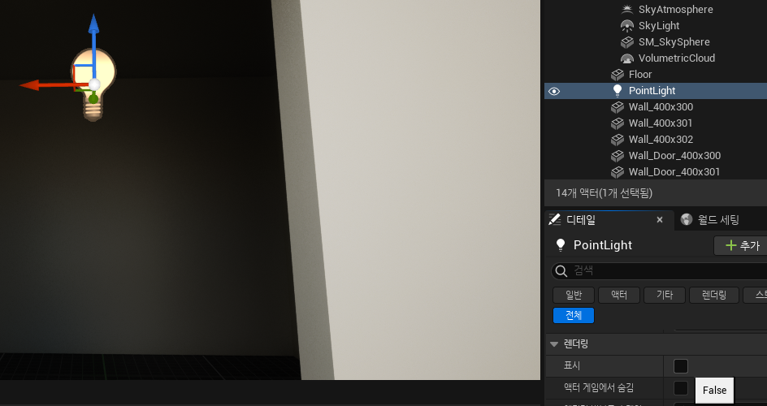

일단 영상에서는 게임 시작 시에 라이트를 켜 주는 블루프린트 스크립트를 만들 것이라 한다.

그러니 표시를 체크 해제하자.

### 레벨 블루프린트 열기

네모들이 연결된 그래프 모양 아이콘을 클릭 후

레벨 블루프린트 열기를 누르자

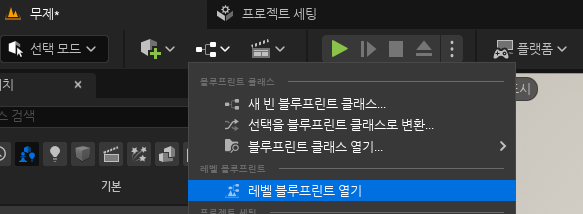

#### 포인트 라이트 레퍼런스 생성

켜진 레벨 블루프린트 창을 줄이고

기존 에디터 즉 레벨에디터로 돌아와 (레벨 블루프린트 창은 켜져있다.)

우리가 배치한 포인트 라이트를 아웃라이너 혹은 뷰포트에서 선택 후 

레벨 블루프린트 창에서 우클릭 함수호출 하단에 레퍼런스 생성 클릭

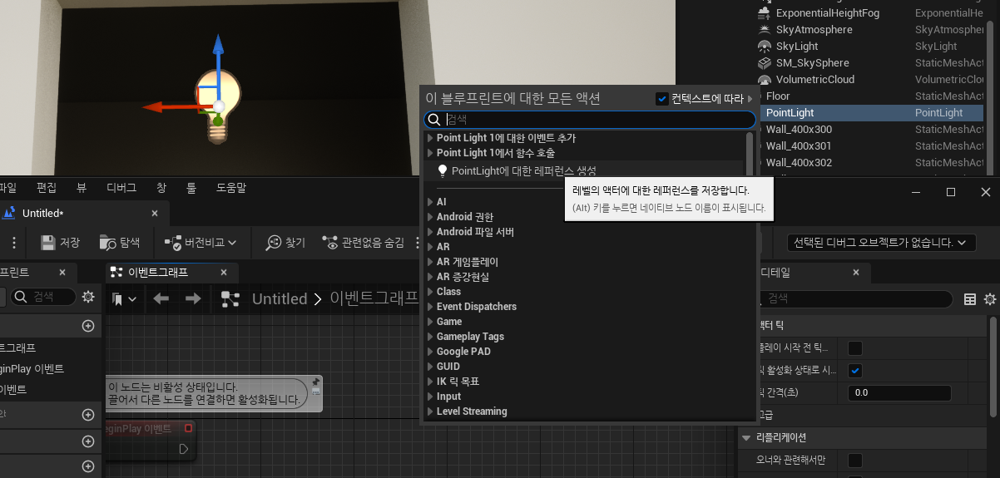

#### 토글비저빌리티 생성

생성한 포인트 라이트 레퍼런스 오른쪽 파란색 작은 원 즉 핀을 `좌클릭 드래그`로 잡아당긴 후 visibility을 검색하여 ToggleVisibility (LightComponent)를 클릭 포인트 라이트 컴포넌트를 해도 되지만 영상에서는 라이트 컴포넌트를 고릅니다.

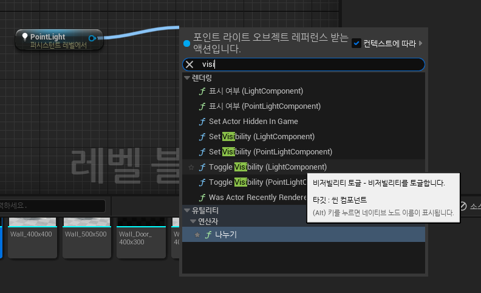

그러면 중간에 라이트 컴포넌트라는 노드도 생기면서 생성된다.

#### BeginPlay 링크

그리고 BeginPlay 이벤트 노드에 Toggle Visibility 노드를 링크(연결) 한다.

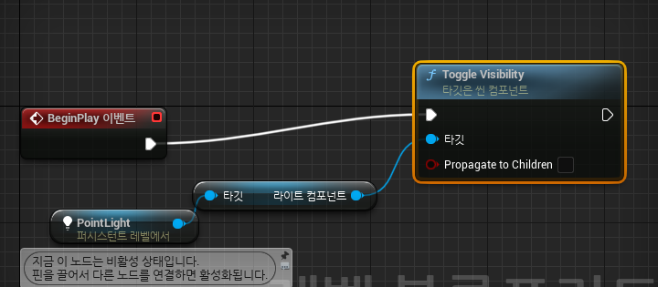

 BeginPlay 이벤트 노드는 게임이 시작되면 연결된 이벤트들이 모두 발동하는 노드이다.

#### 실행

레벨 블루프린트 에디터 창 좌상단에 컴파일 후 실행해보자

이번 실행은 실행 우측 점 3개를 클릭하여 시뮬레이트로 해보자

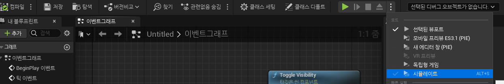

시뮬레이트 모드는 레벨을 만들 때 많이 사용하고 레벨을 관찰하기 위한 모드다. 

해보면 게임이 시작하면 불이 켜진느 걸  확인할 수 있다.

다시 선택된 뷰포트로 바꾸어 실행도 해보자

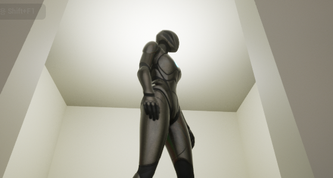

다음은 이 기능을 사용자가 직접 불을 껐다 켤 수 있게 만든다고 한다.

#### 저장

만약에 영상을 계속 이어서 할 예정이 아니라면 

`Ctrl+s` 혹은 파일->현재 레벨 저장을 내가 원하는 이름으로 저장하자

그리고 저장 후 혹시 모르니 파일->모두 저장 혹은 `Ctrl+Shift+s`로 한번 더 저장하자.

만약 다시 이 프로젝트를 킨다면 파일->레벨 열기->내가 정한 이름 으로 들어오자

이것이 번거롭다면 

편집->프로젝트 세팅->프로젝트 밑에->맵&모드->Default Maps 하단에->에디터 시작 맵 을 내가 정한 이름 맵으로 바꾸자.

### 기타 정리

블루 프린트는 크게 레벨 블루프린트와 클래스 블루프린트로 이루어짐.

블루프린트란?

​	비주얼 스크립팅 시스템

​	시각적으로 특정 기능을 가진 노드들을 연결해서 코딩하는 시스템

​	레벨 블루프린는 각각의 레벨에서만 기능을 발휘

​	클래스 블루프린트는 특정 레벨에만 한정되지 않음

​	

​	레벨 블루프린트 내의 스크립트는 해당 레벨 내에서만 유효함.

​	레벨 프린트 열었을 때 중앙의 모눈 창은 이벤트 그래프이다.

​	각 노드의 배치와 연결작업은 이벤트 그래픔에서 이루어짐.

​		마우스 휠 위 아래 굴려 확대 축소 가능

​		좌클릭 드래그로 여러 노드 한번에 선택 가능

​		마우스 가져다 되면 간단하게 기능 확인 가능

​		Tick 이벤트는 각 프레임마다 호출

​			매 플레임마다 이 노드와 연결된 이벤트가 발동

​	실행 핀은 실행 핀끼리만 연결됨

​	파란 선 오브젝트를 연결하는 선

​		레벨 내 오브젝트의 레퍼런스들 연결

​	하얀 선 실행을 나타내는 선

​	Toggle Visibility

​		visibility를 토글 해줌(껐다 켰다 한다는 이야기)